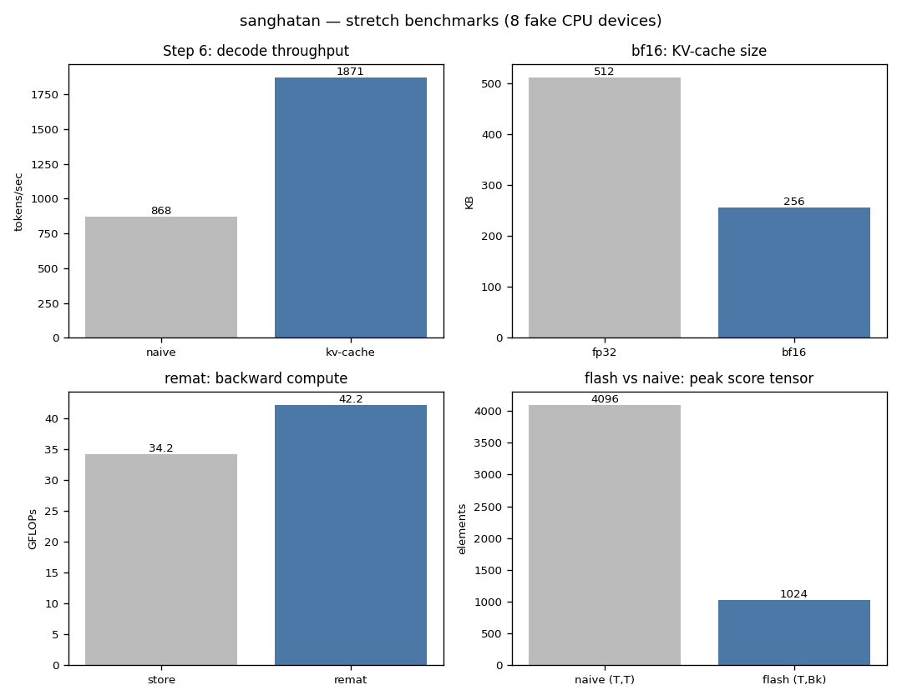

# sanghatan

A decoder-only transformer written from scratch in **plain JAX** — no flax,
no optax. Explicit params pytrees threaded through pure functions, so
`grad`/`jit`/`vmap`/`scan`/sharding are visible, not hidden by a framework.

```bash
pip install -e .                 # core dep: jax only
python -m sanghatan.kvcache      # any module self-checks when run
python -m sanghatan.bench        # regenerate the chart below
```

## Implemented

- **Transformer** (`transformer.py`) — token+positional embedding, causal
  multi-head attention, RMSNorm, GELU MLP, pre-norm residuals. Pure
  functions over a nested-dict param pytree.
- **Training** (`train.py`) — softmax cross-entropy, hand-rolled Adam,
  `vmap` batch, the whole loop as one `jit`-ed `lax.scan`.
- **Sharding** (`shard.py`) — tensor- and data-parallel forward on a device
  mesh; dumps + annotates the HLO ([notes/05](notes/05_hlo_walkthrough.md)).
- **KV-cache decode** (`kvcache.py`) — parallel prefill + fixed-buffer
  single-token decode, bit-identical to naive recompute
  ([notes/06](notes/06_kvcache_bench.md)).
- **bf16** (`precision.py`), **2D data×tensor parallel** (`mesh2d.py`),
  **`jax.checkpoint`** (`remat.py`), **flash-style attention** (`flash.py`).

## Benchmarks



| comparison | result |
|--|--|
| KV-cache vs naive decode | **~11x** tokens/sec, ~9x less scratch, bit-identical |
| bf16 vs fp32 KV cache | **512→256 KB**, max logit drift 0.65 |
| 2D data×tensor parallel | == single-device; only `tp` axis pays all-reduces |
| `jax.checkpoint` (24-layer backward) | **+23% FLOPs**; memory win is TPU/GPU-side |
| flash vs naive attention | bit-identical; `(T,T)` tensor absent from flash HLO |

One run on 8 fake CPU devices
(`XLA_FLAGS=--xla_force_host_platform_device_count=8`); reproduce via the
module commands. bf16 is slower on CPU (emulated) — reported, not hidden.

## Conventions

Pure functions, no mutation, explicit PRNG keys, no Python branching on
traced values. Params are an explicit pytree passed as `f(params, x)`.
Organization follows sglang-jax; the plain-JAX choice deliberately does not,
to keep the mechanics visible. `matplotlib` is an optional `[bench]` extra;
`assets/bench.png` is committed so the library stays zero-dep.
